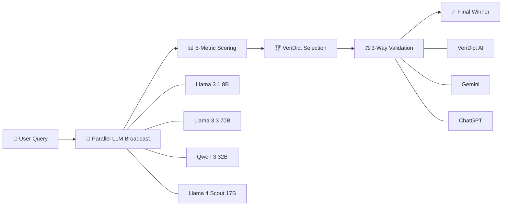

<div align="center">

# 🧠⚡ LLM Council

### **AI Decision Engine for Multi-Model Reasoning, Scoring, and Validation**

<p>
  <a href="https://llm-council-blue.vercel.app"></a>
  
  
  
  
</p>

<p>
  
  
  
  
  
</p>

**LLM Council** orchestrates multiple frontier models in parallel, computes weighted quality metrics, and performs independent cross-validation through **VeriDict AI**, **Gemini**, and **ChatGPT** to select the strongest final answer.

</div>

---

## ⚡ Live Demo

<div align="center">

### 🚀 **Try it now:** [**llm-council-blue.vercel.app**](https://llm-council-blue.vercel.app)

</div>

---

## 🎬 How It Works

<div align="center">

<table>
<tr>
<td align="center">

```text
👤 USER QUERY
    │
    ▼
📡 PARALLEL MODEL BROADCAST
(4 LLMs answer simultaneously)
    │
    ▼
📊 5-METRIC SCORING ENGINE
(Relevance • Semantic • Agreement • Clarity • Length)
    │
    ▼
🏆 VERIDICT COUNCIL WINNER
(Top response selected)
    │
    ▼
⚖️ 3-WAY VALIDATION ARENA
(VeriDict vs Gemini vs ChatGPT)
    │
    ▼
✅ FINAL WINNER
(Highest weighted score)
```

</td>
</tr>
</table>

</div>



---

## ✨ Features

<div align="center">

<table>
<tr>
<th>Feature</th>
<th>Description</th>
<th>Visual</th>
</tr>
<tr>
<td><b>Premium Landing Experience</b></td>
<td>Animated hero, floating orbs, gradients, glassmorphism, and startup-grade polish.</td>
<td>🌌✨🫧</td>
</tr>
<tr>
<td><b>Real-Time Metrics Dashboard</b></td>
<td>Per-model score cards, weighted metrics, and immediate ranking visibility.</td>
<td>📊⚡📈</td>
</tr>
<tr>
<td><b>Metrics Explainer</b></td>
<td>Transparent formulas, weights, and detailed scoring breakdown by model.</td>
<td>🧮🧠📐</td>
</tr>
<tr>
<td><b>3-Way Validator Panel</b></td>
<td>Independent comparison across VeriDict, Gemini, and ChatGPT on the same rubric.</td>
<td>⚖️🔍🏁</td>
</tr>
<tr>
<td><b>Evaluation History</b></td>
<td>Persistent query history with performance and reliability tracking.</td>
<td>🗂️⏱️📌</td>
</tr>
<tr>
<td><b>Responsive Across Devices</b></td>
<td>Fluid UX from mobile to large-screen desktop dashboards.</td>
<td>📱💻🖥️</td>
</tr>
</table>

</div>

---

## 🧠 The Council

<div align="center">

<table>
<tr>
<th>Model</th>
<th>Specialty</th>
<th>Provider</th>
<th>Gradient Badge</th>
</tr>
<tr>
<td><b>Llama 3.1 8B</b></td>
<td>Fast baseline reasoning and concise response generation</td>
<td>Groq</td>
<td>🔵🟣</td>
</tr>
<tr>
<td><b>Llama 3.3 70B</b></td>
<td>Deep contextual understanding and long-form synthesis</td>
<td>Groq</td>
<td>🟣🔴</td>
</tr>
<tr>
<td><b>Qwen 3 32B</b></td>
<td>Strong structured output and analytical consistency</td>
<td>Groq</td>
<td>🟢🔵</td>
</tr>
<tr>
<td><b>Llama 4 Scout 17B</b></td>
<td>Balanced performance across precision and speed</td>
<td>Groq</td>
<td>🟠🟣</td>
</tr>
</table>

</div>

---

## 📊 Scoring Formula

```math
Given query q and response r_i:

FinalScore(r_i) = 0.30·Relevance(r_i, q)
                + 0.25·SemanticSimilarity(r_i, R)
                + 0.20·Agreement(r_i, R)
                + 0.15·Clarity(r_i)
                + 0.10·LengthOptimization(r_i)

where R = set of all model responses.
```

| Metric | Weight | Formula | What It Measures |
|---|---:|---|---|
| **Relevance** | 30% | `cosine_similarity(embedding(q), embedding(r_i))` | Query-response topical alignment |
| **Semantic Similarity** | 25% | `avg_j cosine_similarity(embedding(r_i), embedding(r_j))` | Semantic closeness to peer responses |
| **Agreement** | 20% | `1 - (std_dev(similarities) / mean(similarities))` | Cross-model consensus stability |
| **Clarity** | 15% | `flesch_reading_ease(r_i) / 100` | Readability and human clarity |
| **Length Optimization** | 10% | `1 - abs(log(length(r_i) / optimal_length))` | Conciseness vs completeness balance |

---

## ⚖️ 3-Way Validator

After the council winner is selected, the same weighted metric pipeline is run independently on:

- **VeriDict AI** (council-selected best response)
- **Gemini Validator**
- **ChatGPT Validator**

The **final winner** is chosen by highest weighted score among all three.

<div align="center">

```text
Council Winner (VeriDict)
        │
        ├──► Gemini Validation
        │
        └──► ChatGPT Validation

Same 5-metric weighted scoring applied to all 3
                │
                ▼
       🏆 Final Decision Winner
```

</div>

---

## 📈 Benchmark Results

### Leaderboard Snapshot (Sample)

| Rank | Validator | Score | Status |
|---:|---|---:|---|
| 🥇 1 | **DeepSeek Chat (VeriDict Best)** | **0.8882** | ✅ Winner |
| 🥈 2 | **ChatGPT Validator** | **0.8757** | ✅ Strong |
| 🥉 3 | **Gemini Validator** | **0.8651** | ✅ Competitive |

---

## 🚀 Quick Start

### 1) Clone

```bash
git clone https://github.com/Abhii2310/LLM-Council.git
cd LLM-Council
```

### 2) Backend (FastAPI)

```bash
cd backend
python3 -m venv .venv
source .venv/bin/activate
pip install -r requirements.txt
cp .env.example .env
uvicorn main:app --reload --host 0.0.0.0 --port 8000
```

### 3) Frontend (React + Vite)

```bash
cd frontend
npm install
cp .env.example .env
npm run dev
```

### 4) Open

- Frontend: `http://localhost:5173`
- Backend API docs: `http://localhost:8000/docs`

---

## 📁 Project Structure

```text
LLM-Council/
├── .github/
│   └── workflows/
│       ├── deploy-gate.yml
│       └── production-gate.yml
├── backend/
│   ├── comparison/
│   ├── database/
│   ├── evaluation/
│   ├── routes/
│   │   └── query_routes.py
│   ├── scripts/
│   │   └── predeploy_check.py
│   ├── utils/
│   ├── main.py
│   ├── requirements.txt
│   └── .env.example
├── frontend/
│   ├── src/
│   │   ├── components/
│   │   ├── pages/
│   │   ├── services/
│   │   └── App.jsx
│   ├── package.json
│   └── .env.example
├── PROJECT_CONTEXT/
├── Makefile
└── README.md
```

---

## 🎨 Design Philosophy

**Visual DNA:** futuristic clarity, glassmorphism depth, neon-accented trust, and data-first storytelling.

| Color | Hex | Usage |
|---|---|---|
| 🟦 | `#3B82F6` | Core data accents, chart highlights |
| 🟪 | `#8B5CF6` | Premium glow states, hero gradients |
| 🟩 | `#10B981` | Success, winner, reliability signals |
| 🟨 | `#F59E0B` | Attention, active evaluations |
| ⬛ | `#0B1220` | Deep background for contrast-rich UI |
| ⬜ | `#E2E8F0` | High-legibility foreground text |

---

## 🧩 Tech Stack

<p>
  
  
  
  
  
</p>
